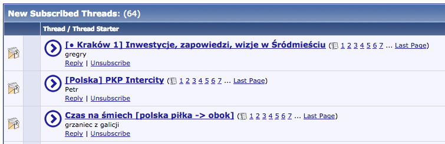

= SSC Grease

Greasemonkey (and friends) scripts for SkyScraperCity.com users.

Tested with Greasemonkey on Firefox.  May require minor changes to work on
Chrome.  May work in IE as well.

== Scripts

=== Big "go to new post" button (improved)

Makes "Go to new post" button on User CP, and Subscriptions pages way bigger,
hence easier to click on.

Preview:

(link:big-go-to-new-post[more])

=== Like highlighter

Highlights the "like" icon if you've already liked that post.

Preview:

image::pics/like-highlighter.png[Preview]

(link:like-highlighter[more])

=== Likes counter

Appends the list of people who liked given post with an information about total
number of these people.

Preview (note 36 total in the end):

(link:likes-counter[more])

== License

May vary, but always FLOSS or public domain.  See respective READMEs.

== See also

- https://addons.mozilla.org/pl/firefox/addon/greasemonkey/[Greasemonkey]
