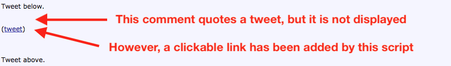

=== Links To Tweets

Adds clickable links to quoted tweets.

If you block 3rd party content, tweets will not be displayed on page.  Quite
possibly, you won't even notice that something was intended to be shown.
Thanks to this script, a regular link will appear, so you can click it,
and read the tweet on Twitter.

==== Preview

==== Source code

link:links-to-tweets.user.js[links-to-tweets.user.js]

==== License

Public domain.  See link:COPYING[COPYING] for details.

==== Contributing

Be aware that everything in this directory will be licensed as public domain.
Don't make a pull request if it doesn't suit you.

==== Notes

Tested with Greasemonkey on Firefox.  May require minor changes to work on
Chrome.  May work in IE as well.
